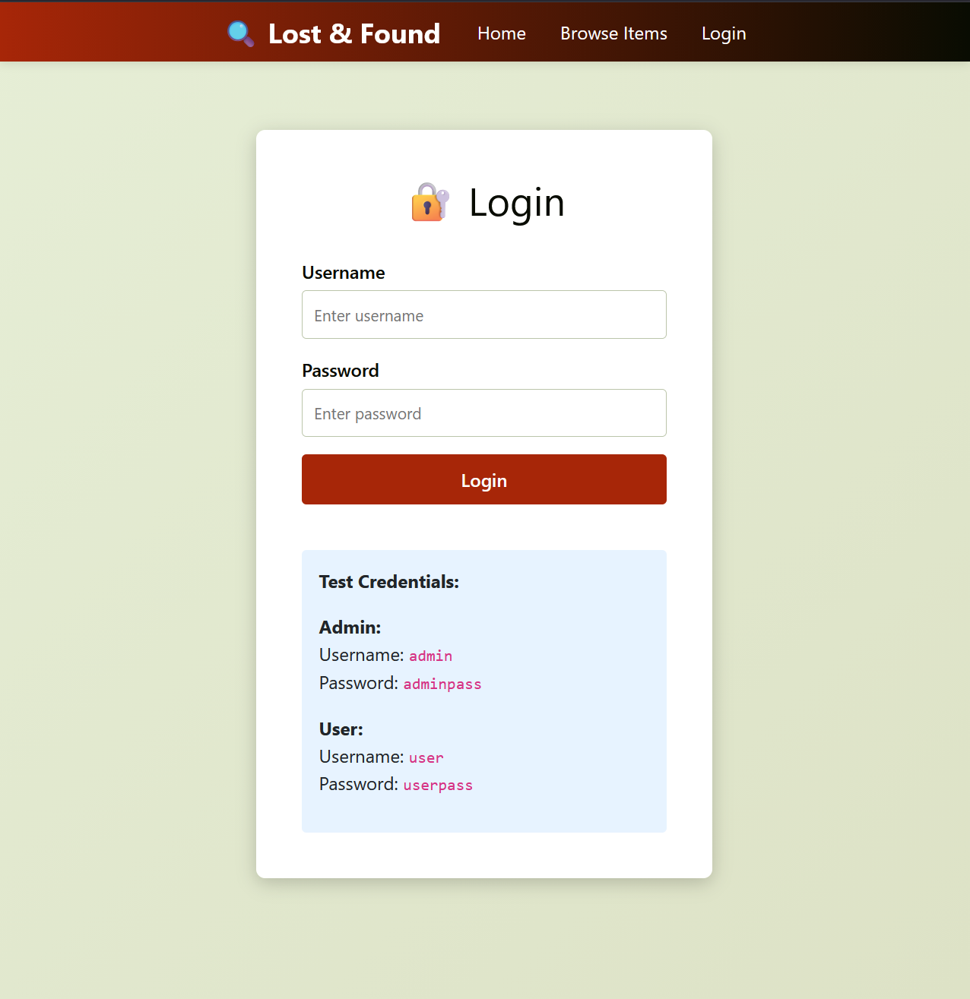
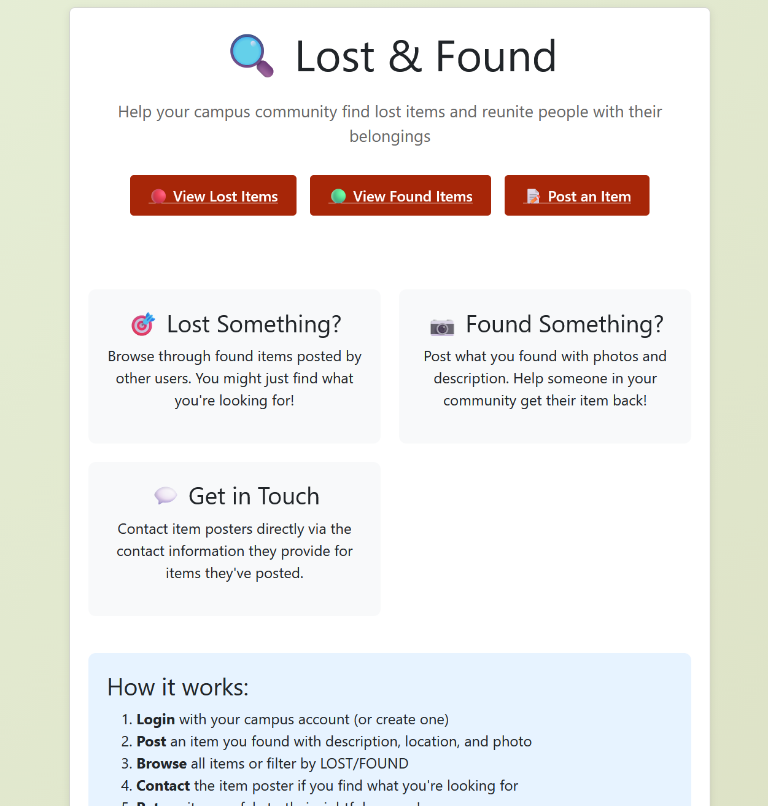

# 370-2025-fall-team7
# Lost and Found CSUSM APP add-on

A application for CSUSM students that is a part of the CSUSM mobile app whose purpose is to make finding and managing of lost items easier for faculty and students. On the app there will be another icon representing the lost and found where only CSUSM students and faculty can post images, manage, and claim lost items in a simple, user-friendly interface. This add-on allows users to see, via images, if something they lost has been found in an efficent way. Verification will still be needed to prevent false claims. 

---

## 📝 Summary

- Users login with their Campus username and password information to gain access to the lost and found service
- Users can view the dashboard to view any items they may have lost 
- Users can make a post looking for a item they have lost or an itemn they have found that may be lost
- Users can message the owner of the post to organize a meet up
- If a post was made by a faculty memeber then user must fill out a forum to provide verification of rightful ownership45

---

##  How to Use (with Screenshots)

###  1. Login with CSUSM username and Password

---

###  2. Visit the Dashboard and choose an option 

---

###  3. View the Item list and sort based off of Found or Lost items

---

###  4. Message owner of the post if the item is one you lost

---

###  5. Make a post of an item you have lost or found

---

### 6. If a post was made by a faculty member, then fill out the forum for verification

